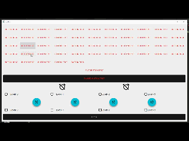

# py

> python version of cpp scripts on qt at the git repo <https://github.com/laserpants/qt-material-widgets>
>
> [Details of the cpp version](cpp/qt-material-widgets-master/README.md)
>
> Edit following files [py/examples/mainwindow.py](py/examples/mainwindow.py) and [py/examples/main.py](py/examples/main.py) and run [py/test_qt_material.py](py/test_qt_material.py) to see the GUI in action.

# qt_material

> A minimized version containing only the important classes
> * [QMaterialFlatButton](qt_material/buttons/flatbutton.py)
> * [QMaterialRaisedButton](qt_material/buttons/raisedbutton.py)
> * [QMaterialIconButton](qt_material/buttons/iconbutton.py)
> * [QMaterialRadioButton](qt_material/buttons/radiobutton.py)
> * [QMaterialCheckBox](qt_material/buttons/checkbox.py)
> * [QMaterialDrawer](qt_material/drawer/drawer.py)
> * [QMaterialCircularProgress](qt_material/progress.py)
> * [QMaterialToggle](qt_material/toggle.py)
> * [QMaterialTab & QMaterialTabs](qt_material/tabs.py)
>
> 
>
> Run [test.py](test.py) to see how it looks and feel

## Thank you

> As the cpp counterparts lacks documentation, contributions will be appreciated to hasten the proper documentation of the project.
>
> ## My Contacts
>
> * WhatsApp (+234 816 852 4477)
> * Gmail (prmpsmart@gmail.com)

